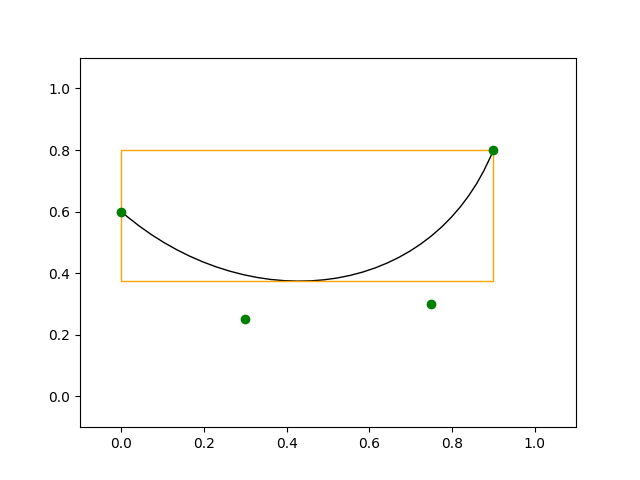

# CubicBezier

CubicBezier is a Python library for visualizing cubic bezier curves.

## Installation

```bash
pip install CubicBezier
```

## Usage

```python
from CubicBezier.cubicbezier import CubicBezier

x = CubicBezier([0.0, 0.3, 0.75, 0.9], 
                [0.6, 0.25, 0.3, 0.8])
x.plot(nodes=True, bounding_box=True)
```


